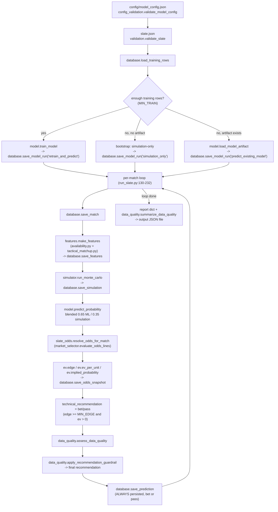
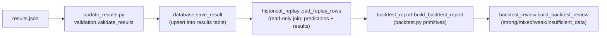
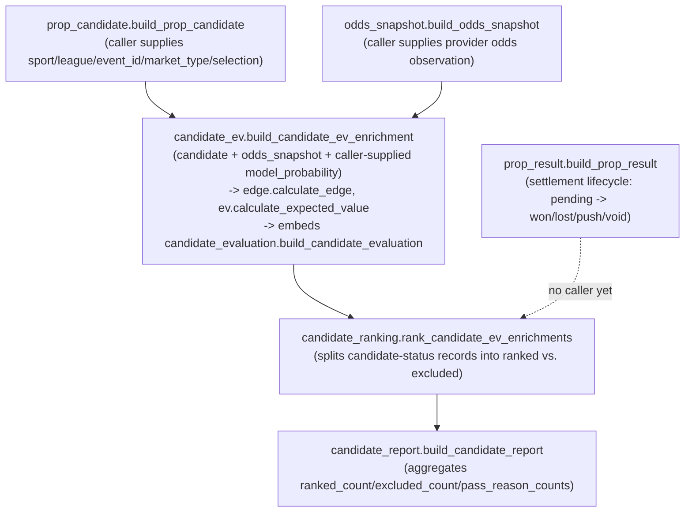
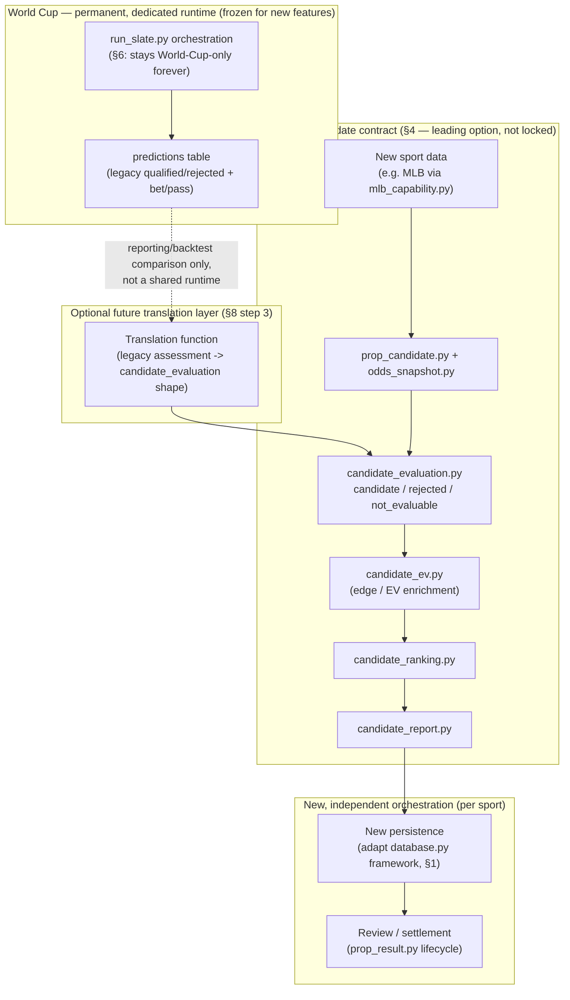

# Legacy Pipeline / Pure-Primitives Architecture Audit

**Status:** Read-only audit. No source, config, schema, test, CI, or version changes were made to produce this document.
**Date:** 2026-07-18
**Branch:** `chore/legacy-pipeline-architecture-audit`
**Baseline:** main @ v0.2.12 (MLB Capability Profile Seed, PR #40)
**Purpose:** Reconcile the legacy World-Cup-scoped runtime pipeline against the newer pure-primitives candidate-decision contract before any new modeling/eligibility/persistence work (v0.3.0+) begins. This document is a reconciliation and recommendation artifact only — no recommendation in it is applied.

**Revision history:** v1 (2026-07-18) — initial audit. v2 (2026-07-18) — revised per ChatGPT/Ryan review: added executive summary, headline finding callout, risk matrix, future-target diagram, softened one prescriptive recommendation into an architectural option, and split `database.py`/`run_slate.py` into explicit mixed-classification breakdowns. No source, config, schema, test, CI, or version changes were made in either revision.

---

## Executive Summary

> **Headline finding: the repository currently contains two independent pipelines, not one pipeline plus supporting primitives.**
>
> A legacy, fully-wired, World-Cup-scoped runtime (`run_slate.py` and everything it orchestrates) already implements probability generation, simulation, eligibility (`qualified`/`rejected`), data-quality guardrails, odds ingestion, and persistence. A separate, newer "pure primitives" candidate-decision contract (`candidate_evaluation.py` and friends) independently implements an overlapping but incompatible eligibility model (`candidate`/`rejected`/`not_evaluable`), with its own odds-snapshot schema, its own data-quality vocabulary, and its own ranking/reporting layer. **The only code shared between the two systems is `ev.py` and, transitively, `odds.py`** (§2). Everything else — including the core eligibility/status vocabulary — was built twice, independently, with no shared import and no reconciliation until this audit.
>
> This means RSB is not "one evolving pipeline with some loose ends." It is two nearly-separate products that happen to live in the same repository and share a small math core. Any new sport, and any new eligibility/confidence work, must be planned with that fact as the starting assumption.

**What to do about it, at a glance:**

| Component | Class | Future |
|---|---|---|
| `run_slate.py` orchestration shape | B (shape reusable; current wiring is C) | Maintain as World-Cup-only; do not evolve into a generic multi-sport orchestrator (see §6) |
| `simulator.py`, `features.py`, `tactical_matchup.py` | C | Freeze — soccer-specific, bug fixes only |
| `model.py` artifact mechanics | B | Reusable pattern; feature set is sport-specific |
| `availability.py` | B | Reusable pattern (11-starter assumption is soccer-shaped) |
| `data_quality.py`, `market_selector.py` | B | Reusable mechanics; vocabulary needs reconciliation (§3/§4) |
| `database.py` persistence framework | Mixed — predominantly A, `results` table is C | Adapt: keep the framework, replace/extend sport-specific outcome columns (§1, §5) |
| `candidate_evaluation.py` + candidate pipeline (`candidate_ev.py`, `candidate_ranking.py`, `candidate_report.py`) | A | Extend — current preferred canonical decision contract (§4), unwired today |
| `ev.py`, `odds.py`, `edge.py` | A | Shared core — already used by both systems |
| `backtest.py`, `backtest_report.py`, `backtest_review.py` | A | Shared core — sport-agnostic, keep as-is |
| `market_capability.py`, `mlb_capability.py` | A | Extend — template for future sport seeds |
| `odds_snapshot.py` vs. `database.py`'s `odds_snapshots` table | Mixed | Reconcile — two independent schemas for the same concept (§3.7, §9) |

Full reasoning, citations, and nuance for every row above are in §1–§8. This table is an index, not a substitute for reading them.

---

## 1. Classification Table

Legend: **A** = reusable as-is · **B** = reusable concept, needs adaptation · **C** = World-Cup-specific, frozen · **D** = duplicated/superseded retirement candidate. Mixed classification (component-level exceptions) is expected and called out under a module's row where it applies.

| Module | Role (one line) | Class | Notes / component exceptions |
|---|---|---|---|
| `src/paths.py` | Central path resolution + env-var overrides | **A** | Sport-agnostic; every module in both systems depends on it. |
| `src/config_validation.py` | JSON config loading + schema validation | **A** | Generic key/type validation; `validate_model_config`/`validate_sports_config`/`validate_bet_rules_config` are thin wrappers that could extend to non-World-Cup configs without rewrite. |
| `src/model.py` | Trains/loads/predicts sklearn logistic regression model per `target_market` | **B** | `model_path_for_version`, `feature_schema_hash`, `validate_feature_schema` (`model.py:28-48`) are sport-agnostic artifact-safety mechanics — reusable. The actual feature set and `target_market="home_win"` default are World-Cup-shaped — needs adaptation per sport. |
| `src/simulator.py` | Monte Carlo goal-based probability engine | **C** | Poisson goal-rate simulation (`base_goal_rates`, `run_monte_carlo` — `simulator.py:20-140`) is soccer-specific (goals, `btts_probability`, `over_25_probability`). Not reusable for MLB/NBA without a new simulation model. |
| `src/features.py` | Builds World Cup model feature dict | **C** | `fifa_rank_diff`, `elo_diff`, xG diffs — soccer-specific inputs (`features.py:5-77`). |
| `src/availability.py` | Lineup/injury/rotation-risk accessors + feature derivation | **B** | The *pattern* (trusted-source vocabulary, confidence/rate/risk accessors, bounded feature set) is sport-agnostic; the specific fields (`starter_availability_rate`, `DEFAULT_NORMAL_STARTER_COUNT = 11` at `availability.py:10`) are soccer-shaped (11 starters). |
| `src/tactical_matchup.py` | Pressing/build-up/set-piece matchup ratings + mismatch flags | **C** | Fully soccer-tactical vocabulary (`press_vs_buildup_edge`, `set_piece_edge` — `tactical_matchup.py:165-192`); no cross-sport analog exists yet. |
| `src/data_quality.py` | Master guardrail: warnings, severity, `data_quality` tri-state, recommendation gate | **B** | `apply_recommendation_guardrail` (`data_quality.py:446-449`) and the general warning/severity/tri-state pattern are reusable design; the specific `ACTION_BLOCK_CODES` set (`data_quality.py:57-78`) mixes generic codes (`insufficient_training_data`, `stale_odds`) with soccer-specific ones (`b_team_rotation_risk`, `tactical_data_missing`). See §3/§4 for taxonomy detail. |
| `src/market_selector.py` | Price qualification: allowed market/selection, odds band, book-count rules → `qualified`/`rejected` | **B** | Qualification *mechanics* (group by match/market/selection, apply config-driven rules, emit reasons) are sport-agnostic; current config (`config/bet_rules_config.json`) is hardcoded to `worldcup`/`h2h`. Reusable if config is parameterized per sport. |
| `config/bet_rules_config.json` | Price-eligibility rule config | **C** (data, not code) | Single profile `worldcup_default` (`bet_rules_config.json:2-4`), `allowed_sports: ["worldcup"]`. Also contains an `edge_rules.minimum_edge` block that `market_selector.py` never reads — dead config (see §3). |
| `config/model_config.json` | Model/training/odds-collection run config | **C** (data, not code) | `target_market: "home_win"`, `odds_collection.markets: ["h2h"]` (`model_config.json:4,17`) — World Cup-shaped values in an otherwise generic schema. |
| `src/odds_collector.py` | CLI: collect + qualify + persist provider odds | **A** | Provider-agnostic orchestration over `odds_providers/`; not World-Cup-coupled beyond reading `sports_config.json`. |
| `src/slate_odds.py` | Match odds lines to slate matches (3-tier strategy) + manual fallback | **B** | `PREDICTION_MARKET = "h2h"` and `SELECTION_FLIP` (`slate_odds.py:8-13`) hardcode a 3-outcome soccer market; the match-id/team-date resolution strategy itself is reusable. |
| `src/odds_providers/base.py` | Provider interface, `NormalizedOddsLine`, team-slug/match-id helpers | **A** | Fully sport-agnostic; `market_selection_from_outcome` maps to `home_win`/`away_win`/`draw` (`base.py:56-63`) which is soccer-shaped but isolated to one function. |
| `src/odds_providers/mock_provider.py` | Hardcoded 2-team mock fixture | **C** | Fixture data is World Cup-specific (`mock_provider.py:56-107`); interface itself is reusable. |
| `src/odds_providers/the_odds_api.py` | Live TheOddsAPI adapter | **A** | Sport-agnostic; takes `sport_key` as a parameter. |
| `src/run_slate.py` | Orchestrator: config→slate→validate→train/predict→simulate→odds→data-quality→persist | **Mixed** (shape B, current wiring C) | Split explicitly: **B — orchestration shape** (the *sequence* — validate → features → probability → simulate → odds → data-quality → persist, `run_slate.py:83-253` — is a reusable pipeline pattern independent of soccer). **C — current wiring** (every stage call in that sequence is hardcoded to World-Cup-only modules and constants: `features.py`, `simulator.py`, module-level `TARGET_MARKET`/`PREDICTION_MARKET`/`MODEL_PATH` at `run_slate.py:26-30`). Per the explicit directional decision in §6, this module is **not** planned to evolve into a generic multi-sport orchestrator — the B-rated shape is noted for completeness/precedent, not as a plan to extend this specific file. |
| `src/validation.py` | Slate/result JSON schema validation | **B** | `REQUIRED_MATCH_FIELDS` (`validation.py:7-15`) includes soccer-shaped fields (`home_team`/`away_team`) but the validation *pattern* generalizes. |
| `src/database.py` | SQLite persistence: 8 tables, migrations, leakage guard | **Mixed** (predominantly A, one table C) | See §5 for full table-by-table breakdown. Split explicitly rather than one overall letter: **A — persistence framework** (the upsert/insert/migration mechanics themselves: `init_db()`, `_column_exists`/`_add_column_if_missing` at `database.py:19-26`, and the generic `match_id`/`run_id`/JSON-blob table shapes for `matches`, `feature_snapshots`, `simulation_outputs`, `model_runs`, `review_notes`). **A — prediction/odds schema** (`predictions` table `database.py:59-92` and `odds_snapshots` table `database.py:104-134` use sport-agnostic column names — `market`, `selection`, `american_odds` — no soccer-specific naming beyond the American-odds-only assumption noted in §3.7). **C — result schema** (`results` table columns `home_win`, `draw`, `away_win`, `btts`, `over_25` at `database.py:137-149` are soccer-outcome-shaped booleans; a new sport needs different result columns entirely, e.g. runs/points scored). The training-leakage guard (`load_training_rows`, `:346-409`) is itself sport-agnostic (A). |
| `src/update_results.py` | CLI: ingest `results.json` → `save_result` | **A** | Thin, generic. |
| `src/backtest.py` | Pure statistical primitives (Brier, log loss, accuracy) | **A** | Fully sport-agnostic. |
| `src/backtest_report.py` | Aggregates replay rows into a backtest report | **A** | Duck-typed over `ReplayRow`-shaped objects; no sport coupling. |
| `src/backtest_review.py` | Classifies a backtest report into strong/mixed/weak/insufficient_data | **A** | Pure thresholds over generic `accuracy`/`evaluated_rows`. |
| `src/historical_replay.py` | Read-only SQLite replay loader for backtesting | **B** | `_derive_actual_label` (`historical_replay.py:25-30`) emits `home_win`/`draw`/`away_win` — soccer-shaped label vocabulary layered on an otherwise generic read-only query pattern. |
| `src/candidate_evaluation.py` | `candidate`/`rejected`/`not_evaluable` status + `pass_reasons` contract | **A** | Sport-agnostic, unwired. Core of the newer taxonomy. |
| `src/candidate_ev.py` | Merges candidate + odds snapshot → edge/EV/candidate_evaluation | **A** | Sport-agnostic, unwired. |
| `src/candidate_ranking.py` | Ranks candidate EV records, splits ranked/excluded | **A** | Sport-agnostic, unwired. |
| `src/candidate_report.py` | Aggregates ranked candidates into a report | **A** | Sport-agnostic, unwired. |
| `src/market_capability.py` | Generic sport/market capability schema builder | **A** | Sport-agnostic by design, unwired. |
| `src/mlb_capability.py` | MLB market capability seed built on `market_capability.py` | **A** | Sport-agnostic pattern applied to MLB; unwired; no World Cup equivalent exists yet (`sports_config.json` still only declares `worldcup`). |
| `src/stage_market.py` | Tournament stage / market-type vocabulary (`group`...`final`, `regulation_result`/`to_advance`) | **B** | Built with soccer tournament structure in mind but is a standalone, unwired vocabulary module — no code in either pipeline imports it. |
| `src/review_taxonomy.py` | Review category/severity/data-quality vocabulary | **A** | Sport-agnostic, unwired. Independently duplicates the 3-value core of `data_quality.py`'s tri-state — see §3. |
| `src/review_notes.py` | Builds a single structured review note using `review_taxonomy` | **A** | Sport-agnostic, unwired. Same English name as `database.py`'s `review_notes` table but no code linkage. |
| `src/odds.py` | Odds/probability conversion math | **A** | Sport-agnostic. The one true leaf dependency shared indirectly by both systems (via `ev.py`). |
| `src/edge.py` | `calculate_edge` | **A** | Sport-agnostic, pure-primitives-only consumer. |
| `src/ev.py` | EV math + validated backward-compatible wrappers | **A** | **The only file imported by both systems** — see §2. Sport-agnostic. |
| `src/prop_candidate.py` | Prop/pick candidate identity schema | **A** | Sport-agnostic, unwired. |
| `src/odds_snapshot.py` | Odds snapshot / provider record schema (pure) | **A** | Sport-agnostic, unwired. Same domain concept as `database.py`'s `odds_snapshots` table + `save_odds_snapshot()`, but zero code sharing — see §3. |
| `src/prop_result.py` | Settlement record schema | **A** | Sport-agnostic, unwired. |
| `src/check_odds_provider.py` | Diagnostics CLI for odds providers | **A** | Low priority per audit scope; sport-agnostic. |
| `src/import_claude_review.py` | CLI: import a Claude review JSON into `review_notes` table | **A** | Low priority per audit scope; trivial. |

---

## 2. Responsibility Ownership Map

Overlap across modules is treated as a finding, not noise — several responsibilities are currently served by two independent implementations that never share code.

| Responsibility | Legacy owner(s) | Pure-primitives owner(s) | Overlap? |
|---|---|---|---|
| Probability generation | `model.py` (sklearn), `simulator.py` (Monte Carlo) | — (none; `candidate_ev.py` takes `model_probability` as caller-supplied, `candidate_ev.py:66` `model_probability` param) | No overlap — pure side has no generator, by design (per Claude_handoff.txt: "caller-supplied only"). |
| Simulation | `simulator.py` | — | N/A |
| Identity normalization | `odds_providers/base.py` (`normalize_team_slug`, `build_match_id` — `base.py:44-53`) | `prop_candidate.py`, `odds_snapshot.py`, `prop_result.py`, `market_capability.py`, `stage_market.py` (`normalize_sport`/`normalize_market_type`/etc., each module reimplements its own slug normalizer) | **Yes** — no shared normalization function between the two systems; each pure-primitives module has its own copy-pasted normalize_* pattern. |
| Data validation | `validation.py` (`validate_slate`, `validate_match`, `validate_results`) | `candidate_evaluation.py`, `candidate_ev.py`, `candidate_ranking.py`, `candidate_report.py`, `prop_candidate.py`, `odds_snapshot.py`, `prop_result.py`, `market_capability.py` (each does its own field-level validation) | Parallel but non-overlapping in subject matter (legacy validates slate/result JSON shape; pure side validates individual record shape) — no direct duplication, but no shared validation helper library either. |
| Data-quality diagnostics | `data_quality.py` (warnings, severity, tri-state) | `review_taxonomy.py` (`VALID_DATA_QUALITIES`), `review_notes.py` | **Yes** — see §3/§4, independently-defined `strong`/`okay`/`weak` vocabularies. |
| Candidate eligibility | `market_selector.py` (`qualified`/`rejected` + reasons) | `candidate_evaluation.py` (`candidate`/`rejected`/`not_evaluable` + `pass_reasons`) | **Yes** — this is the primary taxonomy overlap; see §3. |
| Pass reasons | `market_selector.py` (dynamic f-string reasons, e.g. `f"below_min_decimal_odds:{best_decimal:.4f}"` — `market_selector.py:92`) | `candidate_evaluation.py` (`VALID_PASS_REASONS` closed frozenset — `candidate_evaluation.py:14-24`) | **Yes** — legacy reasons are free-form/dynamic strings; pure side is a closed, validated vocabulary. Not compatible without a mapping layer. |
| Odds ingestion | `odds_collector.py`, `odds_providers/` package | — (none; `odds_snapshot.py` is a schema, not an ingestion mechanism) | No overlap — pure side has no ingestion, only a target schema shape. |
| Price evaluation (EV/edge) | `run_slate.py` (`ev.py` functions inline — `run_slate.py:156-158`), `market_selector.py` (price-band checks) | `candidate_ev.py` (`build_candidate_ev_enrichment`) | **Partial** — both compute edge/EV via the shared `ev.py`/`odds.py` leaf functions (see below), but through two entirely separate orchestration paths with no shared caller. |
| Ranking | — (none; `run_slate.py` produces one prediction per match, no cross-match ranking) | `candidate_ranking.py` | No overlap — legacy has no ranking layer at all. |
| Persistence | `database.py` (8 SQLite tables) | — (none; no pure-primitives module writes anywhere) | No overlap — pure side is fully unwired from persistence, by design (confirmed via full-repo grep: zero `__main__` blocks, zero references outside `tests/`). |
| Settlement | `update_results.py` → `database.save_result()` (final W/D/L outcome only) | `prop_result.py` (`build_prop_result`, granular settlement statuses: `won`/`lost`/`push`/`void`/`pending`/`unknown`) | **Partial** — legacy settlement is binary/ternary match outcome; pure side models per-market/per-prop settlement lifecycle. Different grain, same domain, no shared code. |
| Reporting | `run_slate.py` (`report` dict, `data_quality.py:summarize_data_quality`) | `candidate_report.py` (`build_candidate_report`) | **Partial** — parallel aggregation logic (both count/summarize outcome categories) with no shared helper. |

**Only genuinely shared code between the two systems:** `src/ev.py` (imported by `run_slate.py:20`, `slate_odds.py:3`, `market_selector.py:5`, `odds_providers/base.py:5` on the legacy side, and `candidate_ev.py:5` on the pure side) and transitively `src/odds.py` (imported by `ev.py:3` and directly by `candidate_ev.py:6-11`, `edge.py:1`). Every other pure-primitives module is dependency-free of the legacy system and vice versa.

---

## 3. Taxonomy Overlap Inventory

### 3.1 Eligibility status: `qualified`/`rejected` vs. `candidate`/`rejected`/`not_evaluable`

- Legacy: `market_selector.py:101` — `"status": "qualified" if not reasons else "rejected"`. Two-state.
- Pure: `candidate_evaluation.py:8-12` — `VALID_CANDIDATE_STATUSES = frozenset({"candidate", "rejected", "not_evaluable"})`. Three-state; the third state (`not_evaluable`) has no legacy equivalent — legacy has no way to say "this couldn't be assessed" as distinct from "assessed and rejected."
- The word `"rejected"` is shared verbatim between both, but the two systems' rejection *reasons* are structurally incompatible (see below).

### 3.2 Rejection reasons: dynamic strings vs. closed vocabulary

- Legacy (`market_selector.py:85-98`): dynamic, value-interpolated strings —
  `f"market_not_allowed:{market}"`, `f"selection_not_allowed:{selection}"`, `f"below_min_decimal_odds:{best_decimal:.4f}"`, `f"above_max_decimal_odds:{best_decimal:.4f}"`, `f"not_enough_sportsbooks:{len(sportsbooks_available)}"`.
- Pure (`candidate_evaluation.py:14-24`): closed, non-interpolated frozenset —
  `"edge_below_minimum"`, `"missing_model_probability"`, `"missing_implied_probability"`, `"invalid_model_probability"`, `"invalid_implied_probability"`, `"market_semantics_unclear"`, `"data_quality_concern"`, `"manual_review_required"`, `"unknown"`.
- No pass reason string is shared between the two sets, and legacy's interpolated values (`:{best_decimal:.4f}`) could never validate against `candidate_evaluation.py`'s `normalize_pass_reason` (`candidate_evaluation.py:73-88`), which expects fixed enum members.

### 3.3 Data-quality tri-state: two independent definitions of the same three words

- Legacy output (`data_quality.py:429-434`): `data_quality` computed as `"weak"` / `"okay"` / `"strong"`.
- Pure vocabulary (`review_taxonomy.py:26-31`): `VALID_DATA_QUALITIES = frozenset({"strong", "okay", "weak", "unknown"})`.
- Same three core values, one extra (`"unknown"`) on the pure side, **zero shared import** — these were independently authored and could silently drift (e.g. a future edit to one's threshold logic would not propagate to the other, despite matching vocabulary).

### 3.4 Severity: `blocker`/`warning` vs. `low`/`medium`/`high`/`critical`

- Legacy (`data_quality.py`, e.g. `:196,215,221,...,272,313`): binary severity — string literals `"blocker"` and `"warning"` scattered inline (not a named constant/frozenset — each `make_warning(code, severity, message)` call at `data_quality.py:90-95` passes one of these two literals directly).
- Pure (`review_taxonomy.py:19-24`): `VALID_REVIEW_SEVERITIES = frozenset({"low", "medium", "high", "critical"})` — four-level, named constant.
- No mapping exists between "blocker" and "critical"/"high", nor between "warning" and "low"/"medium" — a future integration must define this mapping explicitly (see §4).

### 3.5 Recommendation gate: `bet`/`pass` + `clear`/`blocked` vs. no legacy analog on the pure side

- Legacy (`run_slate.py:186`): `technical_recommendation = "bet" if edg >= MIN_EDGE and ev > 0 else "pass"`.
- Legacy (`data_quality.py:440`): `recommendation_guardrail` — `"clear"` / `"blocked"`.
- Pure side has no `"bet"`/`"pass"` concept at all — the closest analog is `candidate_ranking.py`'s `ranking_status` (`"ranked"` / `"excluded"`, assigned at `candidate_ranking.py:255,259`), which is a *ranking* inclusion flag, not a betting recommendation. These are conceptually adjacent but not interchangeable: a candidate can be `"ranked"` (has positive edge) while a full RSB product would still need the data-quality/guardrail layer (currently legacy-only) to decide whether it's actually `"bet"`-worthy.

### 3.6 Settlement status: binary/ternary outcome vs. six-state lifecycle

- Legacy (`database.py:137-149`, `results` table): `home_win`, `draw`, `away_win`, `btts`, `over_25` — boolean columns derived from final score, no lifecycle state (a result either exists or doesn't).
- Pure (`prop_result.py:8-15,17-22`): `VALID_SETTLEMENT_STATUSES = frozenset({"won","lost","push","void","pending","unknown"})`, with `FINAL_SETTLEMENT_STATUSES = frozenset({"won","lost","push","void"})` as a subset — models a full pre/post-settlement lifecycle including void/push, which the legacy `results` table cannot represent at all (no column for "this market voided").

### 3.7 Odds-snapshot record: two independent schemas for the same concept

- Legacy: `database.py:105-123` (`odds_snapshots` table, written via `save_odds_snapshot()` at `database.py:256-297`) — columns `run_id, match_id, sportsbook, market, selection, american_odds, implied_probability, captured_at, provider, provider_event_id, sport_key, home_team, away_team, commence_time, raw_json`.
- Pure: `odds_snapshot.py:127-166` (`build_odds_snapshot`) — returns `provider, sportsbook, event_id, market_type, selection, line, odds, odds_format, odds_found_at, source, metadata`.
- Same domain object, different key names for overlapping concepts (`match_id` vs. `event_id`; `american_odds` vs. `odds`+`odds_format`; `captured_at` vs. `odds_found_at`), zero shared code, and the pure version supports `odds_format` (american/decimal) while the legacy table hardcodes American odds only (`american_odds` column name, always stored via `int(odds_line["american_odds"])` at `run_slate.py:155`).

---

## 4. Canonical Vocabulary Recommendation *(architectural options — not applied, not locked)*

The core architectural need is to **choose one canonical decision contract** rather than let a third taxonomy emerge alongside legacy's `qualified`/`rejected` and the pure side's `candidate`/`rejected`/`not_evaluable`. Which specific contract fills that role is a scoping decision for whoever gates the next version (per [[feedback_chatgpt_gatekeeper_workflow]]) — this document does not lock that choice.

The current preferred direction per prior discussion, stated here as the leading option for review, not as an implemented decision:

1. **Adopt `candidate_evaluation.py`'s three-state status (`candidate`/`rejected`/`not_evaluable`) as the canonical contract**, since it is a strict superset of legacy's two-state `qualified`/`rejected` — `not_evaluable` gives a home to cases legacy currently has no vocabulary for (e.g., missing model probability, which legacy would otherwise silently fall through to a `"pass"` recommendation without distinguishing "correctly assessed as bad" from "couldn't be assessed at all"). A different contract could be chosen instead without invalidating the taxonomy overlap analysis in §3 — that analysis documents what exists and where it conflicts, independent of which side eventually wins.
2. **Bucket legacy's `ACTION_BLOCK_CODES` (`data_quality.py:57-78`) into three target buckets feeding `candidate_evaluation`'s existing contract**, rather than inventing a fourth taxonomy:
   - **Diagnostic-only** (informational, does not by itself block): e.g. `fitness_concerns_present`, `returning_players_present`, `tactical_mismatch_review_required`.
   - **Eligibility-failure** (maps to a `pass_reasons` member, blocks candidate status): e.g. `insufficient_training_data` → `data_quality_concern`; `provider_odds_missing`/`stale_odds` → `missing_implied_probability` or a new reason; `missing_feature_fields` → `data_quality_concern`.
   - **Reliability-modifier** (does not block eligibility but should attach a confidence/data-quality score downstream, feeding `candidate_ranking.py`'s existing `data_quality_scores`/`confidence_scores` parameters, which already exist but are currently always caller-supplied `None` since nothing wires them): e.g. `low_lineup_confidence`, `low_tactical_confidence`, `b_team_rotation_risk`.
   - Several current legacy codes (`manual_odds_used`, `manual_odds_fallback_used`) don't cleanly fit any bucket and would need an explicit decision — flagged here, not resolved.
3. **Do not keep `market_selector.py`'s dynamic f-string reasons as-is** if unified — they'd need to become fixed enum members (e.g. `below_min_decimal_odds:{value}` → `edge_below_minimum` or a new `price_out_of_range` member) with the interpolated value moved to a separate structured field, since `candidate_evaluation.normalize_pass_reason` (`candidate_evaluation.py:73-88`) validates against a closed set and cannot accept interpolated strings.
4. **Reconcile the two independently-defined `data_quality` tri-states** (`data_quality.py:429-434` vs. `review_taxonomy.py:26-31`) by having one import the other's vocabulary rather than maintaining two frozensets with the same three core values by convention only.
5. **Map legacy's binary `blocker`/`warning` severity onto `review_taxonomy.py`'s four-level `low`/`medium`/`high`/`critical`** — the direction discussed was `blocker → critical` (or `high`, case-by-case) and `warning → low`/`medium` depending on the specific code's current weight in `apply_recommendation_guardrail`. Needs a full per-code mapping table before implementation, not a blanket rule.

This section is a recommendation for a future scoped version, not a spec to implement now.

---

## 5. Persistence and Versioning Semantics

Full table inventory from `src/database.py`, `init_db()` (`database.py:34-170`):

| Table | Represents | Key | Write mode | Timestamp semantics | `model_version` tracked? |
|---|---|---|---|---|---|
| `matches` (`:34-45`) | Latest snapshot of one slate match's raw payload | `match_id` (PK) | `INSERT OR REPLACE` (`save_match`, `:176-195`, upsert at `:180`) | `created_at` — **overwritten** on every re-save (write time, not first-seen time); historical match-payload state is **not** reconstructable across runs. | No |
| `feature_snapshots` (`:47-57`) | Feature vector for one match in one run | `(run_id, match_id)` unique (`:55`) | `INSERT OR REPLACE` (`save_features`, `:198-207`, upsert at `:202`) | `created_at` = write time | Yes (`:52`) |
| `predictions` (`:59-92`) | One model prediction/recommendation for one match in one run | autoincrement, no dedup key | Plain `INSERT` (`save_prediction`, `:210-241`, `:213`) — **append-only** | Single `created_at` = write time (event vs. observation vs. write time are not distinguished — there is one timestamp only) | Yes (`:63`) |
| `simulation_outputs` (`:94-102`) | Monte Carlo result for one match in one run | autoincrement | Plain `INSERT` (`save_simulation`, `:244-253`) — append-only | `created_at` = write time | No (implicit via `run_id` join to `model_runs`) |
| `odds_snapshots` (`:104-134`) | One captured odds line (provider-collection or per-match resolved) | autoincrement | Plain `INSERT` (`save_odds_snapshot`, `:256-297`, and batch wrapper `save_odds_lines`, `:300-317`) — append-only | `captured_at` set via `utc_now()` **at write time** (`:287`) — this is *not* the provider's own `last_update`/quote timestamp, so it cannot currently support true CLV comparison against `odds_found_at` semantics the pure side already models (`odds_snapshot.py`'s `odds_found_at` field). | No |
| `results` (`:136-149`) | Ground-truth match outcome | `match_id` (PK) | `INSERT OR REPLACE` (`save_result`, `:320-343`, upsert at `:327`) | `updated_at` (`:341`) — this is the field the training-leakage guard (`load_training_rows`, `:346-409`) compares against `feature_snapshots.created_at` (`:383-388`) to prevent post-result features leaking into training. | No |
| `model_runs` (`:151-160`) | Metadata for one `run_slate.py` invocation | `run_id` (PK) | `INSERT OR REPLACE` (`save_model_run`, `:412-421`, upsert at `:416`) | `created_at` = write time | Yes (`:154`, explicit column) |
| `review_notes` (`:162-170`) | Freeform review annotation (e.g. imported Claude review JSON) | autoincrement | Plain `INSERT` (`save_review_note`, `:424-433`) — append-only | `created_at` = write time | No |

**Model-version tracking:** No dedicated version-registry table exists. `model_version` is a plain TEXT column repeated on `feature_snapshots`, `predictions`, and `model_runs` — there is no FK relationship enforcing consistency across the three, and no schema-version column exists anywhere in the database. A future version-registry table (mapping `model_version` → training metadata, feature schema hash, artifact path) would need to be added, not currently exist.

**Append-only vs. upsert, by design intent inferred from usage:**
- Genuinely append-only (audit trail): `predictions`, `simulation_outputs`, `odds_snapshots`, `review_notes`.
- Upsert (latest-state-only, history not preserved): `matches`, `feature_snapshots`, `results`, `model_runs`.

**Whether historical state is reconstructable:** For append-only tables, yes — every `predictions`/`odds_snapshots` row is preserved per `run_id`. For upsert tables, no — re-running `run_slate.py` against an updated slate overwrites `matches` and `feature_snapshots` in place; only the run-scoped foreign rows in the append-only tables preserve what a given run actually saw.

**Whether predictions are persisted before or after qualification:** After. In `run_slate.py`, `technical_recommendation` is computed (`:186`), then `assess_data_quality`/`apply_recommendation_guardrail` run (`:187-195`), and only then is the fully-assembled `pred` dict (containing both the technical and guarded recommendation) persisted via `save_prediction(pred)` at `:231`. There is no separate "pre-qualification" persisted state.

**Whether rejected/not_evaluable candidates are persisted:** `save_prediction()` is called unconditionally for every match in the per-match loop (`run_slate.py:130-232`, `save_prediction(pred)` at `:231`) — **there is no code path that skips writing a prediction**, regardless of `recommendation` value (`"bet"` or `"pass"`). Both qualifying and non-qualifying predictions land in the single `predictions` table, distinguished only by the `recommendation`/`technical_recommendation`/`data_quality`/`actionable`/`recommendation_guardrail` columns — not by separate tables, not by a `not_evaluable`-equivalent status. **This directly validates that the shadow-logging/selection-bias concern raised earlier is not currently a problem in the legacy pipeline** — nothing is silently dropped before persistence. The open question is only whether the *pure* system's richer three-state vocabulary, if wired in later, would preserve this "always persist" property or introduce a path where `not_evaluable` records get filtered out before reaching a database (moot today since the pure side has no persistence layer at all — see §2).

---

## 6. Pipeline-Level World Cup Freeze Policy

Defined at the pipeline level first, per the required structure, before any module-level consequence:

**Decision: The legacy World Cup pipeline (`run_slate.py` and everything it orchestrates — `model.py`, `simulator.py`, `features.py`, `availability.py`, `tactical_matchup.py`, `data_quality.py`, `market_selector.py`, `slate_odds.py`, `odds_collector.py`, `validation.py`, `database.py`, `update_results.py`) is frozen for new World-Cup-specific feature development, but remains in full runtime support.**

Concretely, by category:

- **Active development:** Frozen. No new World Cup features, no new soccer-specific tactical/availability fields, no changes to `simulator.py`'s goal-rate model, unless a specific World Cup bug or data-correctness issue is found. New development effort should go toward the pure-primitives contract and future sport seeds (MLB, etc.) instead.
- **Runtime support:** Fully maintained. `run_slate.py`, `odds_collector.py`, `update_results.py` remain runnable and are the only working end-to-end pipeline in the repo today — they are not being deprecated or removed.
- **CI coverage:** Fully maintained. All existing `tests/test_*.py` files for legacy modules continue running and must continue passing; no reduction in legacy test coverage is authorized by this audit.
- **Model artifacts:** Existing versioned artifacts (via `model_path_for_version`, `model.py:28-29`) remain valid and loadable; no artifact migration is proposed.
- **Database writes:** Continue as-is. No schema changes, no table additions/removals, no migration proposed by this audit (§5's version-registry-table idea is a future recommendation, not a decision).
- **Constraints on future MLB/NBA dependencies:** Future sport pipelines (starting from `mlb_capability.py`'s already-seeded but unwired profile) **must not** be built by extending `run_slate.py`'s existing World-Cup-coupled call sites (`features.py`, `simulator.py`, `TARGET_MARKET`/`PREDICTION_MARKET` module-level constants at `run_slate.py:26-30`). A new sport's runtime pipeline should either (a) be built on the pure-primitives contract from the start, or (b) if it needs an orchestration shape, be a *new, separate* orchestrator that imports the *reusable* legacy pieces (class A/B modules from §1: `database.py`, `config_validation.py`, `odds_collector.py`, `odds_providers/`, `backtest*.py`) rather than modifying `run_slate.py` itself to branch on sport.

**Explicit directional decision (added on review, 2026-07-18): `run_slate.py` remains the permanent, dedicated World Cup runtime and is not planned to evolve into a generic multi-sport orchestrator, ever — not just "not yet."** This sharpens the constraint above from a sequencing note into a standing architectural boundary: even though §1 notes that `run_slate.py`'s orchestration *shape* is reusable in the abstract (Mixed B/C classification), that reusability is documented for precedent only. The intended path for MLB and future sports is `new sport data → pure primitives → new, independent orchestration` (§7d), not `run_slate.py` generalized with sport branches. If a future translation layer is built to reconcile legacy output into the canonical candidate contract (§4, §8 step 3), that layer is for vocabulary/reporting convergence — comparing or backtesting legacy World Cup predictions alongside newer-sport candidates — not a mechanism for repurposing `run_slate.py` as a shared runtime.

**Module-level consequences for Class-C (frozen) modules**, following from the pipeline decision above: `simulator.py`, `features.py`, `tactical_matchup.py`, `odds_providers/mock_provider.py` receive no new soccer-specific functionality; bug fixes only. `data_quality.py` and `market_selector.py` (Class B) may still evolve, but only in the generic/reusable direction described in §4, not with more soccer-specific warning codes.

---

## 7. Flow Diagrams

### 7a. Legacy pipeline (current, fully wired, runnable via `python -m src.run_slate`)

Settlement/backtest is a **separate, disconnected entry point**, not part of the `run_slate.py` call chain:

### 7b. Pure-primitives flow (fully unwired — exists only as importable functions exercised by `tests/test_*.py`; no `__main__`, no orchestrator calls any of these)

### 7c. Explicit relationship statement

These are **two disconnected pipelines that overlap in domain concept but share almost no code and no orchestrator**. They are not "one legacy pipeline plus reusable primitives" (the pure side is not called from the legacy side at all, anywhere), and they are not simply "overlapping stages that already converge" (nothing currently merges them). The only structural bridge is the shared leaf-level math in `ev.py`/`odds.py` (§2), which both sides import independently without either depending on the other's higher-level records. Any future convergence is a deliberate wiring decision that has not been made yet — this audit documents the gap, it does not close it.

### 7d. Future target architecture *(direction only — no implementation authorized by this document)*

This shows where the two flows in §7a/§7b are intended to head, per the directional decision in §6 and the options in §4/§8. It is not a build spec.

Key points this diagram is making explicit:
- The **World Cup box never merges into the canonical/future boxes as a runtime** — its only possible link is the dashed, optional translation arrow for reporting/backtest comparison, not for execution.
- **New sports do not pass through `run_slate.py` at all** — they enter directly at the pure-primitives layer.
- The canonical contract shown is `candidate_evaluation.py` because that is §4's current leading option; if a future scoping decision picks a different contract, this diagram's middle box changes, not the overall shape (legacy stays isolated; new sports build on a canonical contract; a canonical contract feeds ranking → persistence → review).

---

## 8. Dependency-Ordered Migration Sequence *(sequence only — no version numbers assigned, no implementation authorized by this document)*

This sequence assumes the direction in §4/§6 is eventually approved; each step depends on the previous one being in place.

1. **Vocabulary reconciliation decision** (depends on: nothing new — §3/§4 of this document). ChatGPT/Ryan decide the final mapping tables for: `ACTION_BLOCK_CODES` → diagnostic/eligibility-failure/reliability-modifier buckets; `blocker`/`warning` → `low`/`medium`/`high`/`critical`; legacy dynamic pass-reason strings → closed `VALID_PASS_REASONS` members (extending the frozenset if new members are needed). This is a decision/spec step, not code.
2. **Extend `candidate_evaluation.py`'s `VALID_PASS_REASONS`** if step 1 determines legacy codes need new closed-vocabulary members not already present (e.g. a `price_out_of_range` or `stale_market_data` member). Pure primitive change only, no wiring.
3. **Build a translation function** (new, small module or function) that converts a legacy `data_quality.py` assessment dict into a `candidate_evaluation.build_candidate_evaluation()` call — this is the first piece of code that imports from *both* systems. Depends on steps 1-2. Still no runtime wiring — this would be tested in isolation like every other pure primitive.
4. **Decide the model-version-registry table** design (§5's gap) if versioned candidate persistence is wanted — independent of steps 1-3, can happen in parallel.
5. **Reconcile the odds-snapshot schema** (§3.7) — decide whether `database.py`'s `odds_snapshots` table gains an `odds_format` column / gets a translation function to `odds_snapshot.py`'s shape, or whether the two remain permanently separate (provider-capture-time schema vs. candidate-evaluation-time schema). Depends on nothing else in this list; can happen anytime.
6. **Only after 1-3 are in place**, consider whether `run_slate.py` should start calling the translation layer to *additionally* (not instead of) populate a `candidate_evaluation` alongside its existing `technical_recommendation`/`recommendation` fields — this is the first actual pipeline-wiring step, and per [[feedback_pipeline_wiring_timing]] must be its own separately-scoped version with an explicit migration plan, not bundled into steps 1-5.
7. **MLB (or next sport) runtime pipeline** — per §6's freeze-policy constraint, this should be designed against the pure-primitives contract (post steps 1-3) rather than by extending `run_slate.py`'s World-Cup-coupled call sites, and is independent of whether step 6 ever happens for World Cup.

Steps 1, 4, and 5 have no code dependency on each other and could be sequenced in any order relative to one another; step 2 depends on 1; step 3 depends on 1-2; step 6 depends on 1-3 and is explicitly the highest-risk, most-scoped-separately step; step 7 depends only on 1-3.

---

## 9. Highest-Risk Integration Points

Ranked by how much damage a wrong or rushed reconciliation decision could cause — not by how much work each item is. This complements §3's overlap inventory and §8's sequencing by adding an explicit priority signal for planning.

| Risk | Integration point | Why it's ranked here |
|---|---|---|
| **High** | Eligibility/status vocabulary (`qualified`/`rejected` vs. `candidate`/`rejected`/`not_evaluable`, §3.1–§3.2) | This is the load-bearing decision every other reconciliation step depends on (§8 step 1 gates steps 2, 3, 6). Picking wrong or picking late blocks the rest of the migration sequence and risks a third taxonomy emerging by accident. |
| **High** | Odds-snapshot schema (legacy `odds_snapshots` table vs. `odds_snapshot.py`, §3.7) | Directly blocks CLV, a first-class proof-of-edge metric per the project's long-term goals — legacy's `captured_at` is write-time, not observation-time, so it cannot support true closing-line comparison until reconciled with `odds_snapshot.py`'s `odds_found_at` semantics. Any new sport's odds ingestion inherits whichever schema is chosen here. |
| **High** | Persistence model / model-version tracking (§5) | No version-registry table exists today; `model_version` is a bare repeated TEXT column with no FK enforcement. Building new versioned candidate persistence on top of this gap before fixing it risks the same "no consistency guarantee" problem propagating into the new system. |
| **Medium** | Data-quality tri-state and severity (`data_quality.py` vs. `review_taxonomy.py`, §3.3–§3.4) | Two independently-defined vocabularies with matching-but-not-identical values can silently drift further apart the longer they're left unreconciled, but neither currently blocks other work — they can be fixed on their own timeline. |
| **Medium** | Settlement lifecycle (legacy `results` table vs. `prop_result.py`, §3.6) | Legacy's boolean-outcome model cannot represent void/push at all, which matters more as soon as prop markets (not just match-outcome markets) enter scope — a MLB/NBA prerequisite, not an immediate one. |
| **Low** | Reporting/aggregation duplication (`summarize_data_quality` vs. `candidate_report.py`, §2) | Parallel but low-stakes — both are read-only aggregation views over data that's correctly persisted either way; consolidating them is a convenience improvement, not a correctness risk. |
| **Low** | Backtest primitives (`backtest.py`/`backtest_report.py`/`backtest_review.py`) | Already sport-agnostic, already shared-core quality (Class A) — no reconciliation work needed at all; listed here only to make the "already fine" set explicit alongside the risks. |

---

## 10. External References for Future Research *(not analyzed this pass — noted only)*

Two public sports-modeling products were identified during this audit as potentially relevant prior art for later architecture research. They are **not** part of this audit's approved scope, have **not** been reviewed in any depth, and are **not** verified as an open-source codebase, downloadable dataset, public API, or permissible automated data source. Neither should be treated as an RSB provider or dependency without a separate licensing/API review.

- **EdgeDesk Sports** ([edgedesksports.com](https://edgedesksports.com/#proof)) — noted as a possible example of structural market validation, automated public grading, closing-line evaluation, and separating structural faults from probabilistic model edges.
- **FiteQuant** ([fitequant.com](https://fitequant.com/)) — noted as a possible example of time-safe backtesting, locked historical predictions, configurable model versions, value filters, and model-cloning workflows.

Both are flagged for a future, separately-scoped research pass — not for this audit and not for immediate implementation.

---

## Appendix: Evidence Index

Selective file:line citations used in this document (not exhaustive — see inline citations throughout):

- Status constants: `market_selector.py:101`, `candidate_evaluation.py:8-24`, `historical_replay.py:27-30`, `backtest_review.py:12-17`, `review_taxonomy.py:5-31`, `prop_result.py:8-22`
- Table definitions: `database.py:34,48,60,94,105,137,152,163`
- Save functions: `database.py:176,198,210,244,256,300,320,412,424`
- Orchestration call sites: `run_slate.py:85,93,94,100-101,109-124,130-232`
- Config: `bet_rules_config.json:2-21`, `model_config.json:3-18`, `sports_config.json` (full file, 11 lines)
